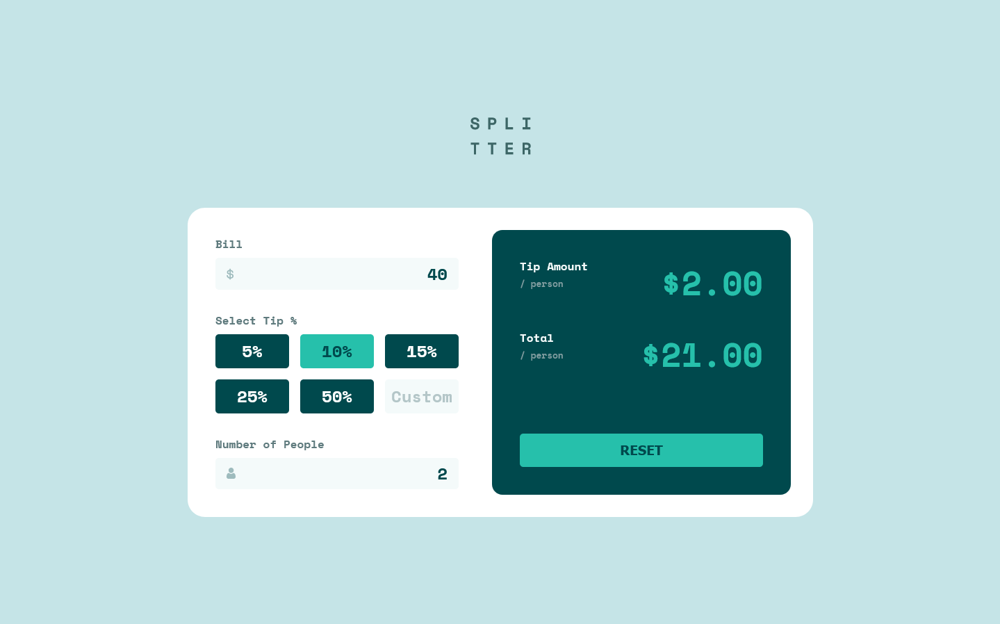

# Frontend Mentor - Tip calculator app solution

This is a solution to the [Tip calculator app challenge on Frontend Mentor](https://www.frontendmentor.io/challenges/tip-calculator-app-ugJNGbJUX).

## Table of contents

- [Overview](#overview)
  - [The challenge](#the-challenge)
  - [Screenshot](#screenshot)
  - [Links](#links)
- [My process](#my-process)
  - [Built with](#built-with)
  - [What I learned](#what-i-learned)
  - [Useful resources](#useful-resources)
- [Author](#author)

## Overview

### The challenge

Users should be able to:

- View the optimal layout for the app depending on their device's screen size
- See hover states for all interactive elements on the page
- Calculate the correct tip and total cost of the bill per person

### Screenshot

### Links

- Solution URL: [https://github.com/lidiakrajewska/tip-calculator-app-main](https://github.com/lidiakrajewska/tip-calculator-app-main)
- Live Site URL: [https://lidiakrajewska.github.io/tip-calculator-app-main/](https://lidiakrajewska.github.io/tip-calculator-app-main/)

## My process

### Built with

- Semantic HTML5 markup
- SASS
- Flexbox
- CSS Grid
- Mobile-first workflow
- JS ES6

### What I learned

- margin: auto won't center an image, because it's an inline element
- location.reload() refreshes the page
- there is focus and blur event listener

### Useful resources

- [W3schools](https://www.w3schools.com/howto/howto_css_hide_arrow_number.asp) - This helped me to make the arrows in numeric inputs invisible
- [StackOverflow](https://stackoverflow.com/questions/149055/how-to-format-numbers-as-currency-strings) - I used this code to format displayed results in USD

## Author

- Frontend Mentor - [@lidiakrajewska](https://www.frontendmentor.io/profile/lidiakrajewska)
- LinkedIn - [Lidia Krajewska](https://www.linkedin.com/in/lidia-krajewska-02512a1a7/)
